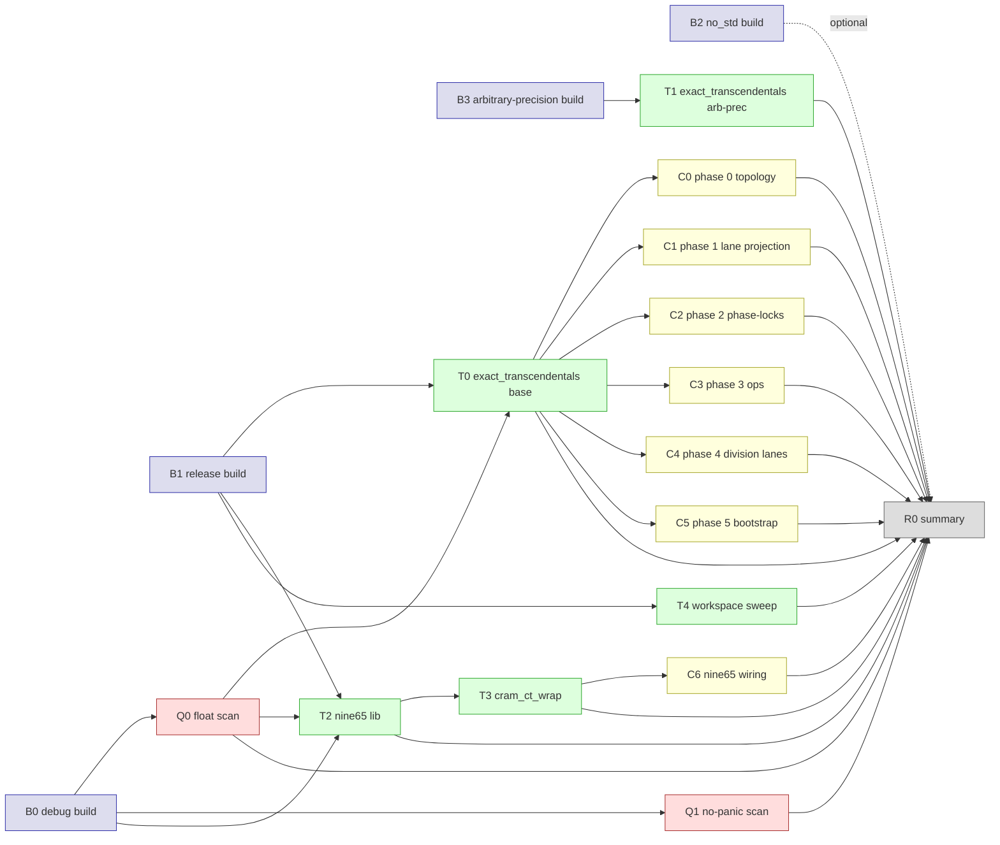

# CRAM-CT Gate DAG

A directed acyclic graph of build / quality / testing / correctness gates for
the CRAM-CT stack. Gates are grouped into tiers; each tier may only depend on
gates in lower-numbered tiers. The runner (`scripts/cram_ct_gates.sh`) walks
the DAG in topological order and short-circuits any gate whose upstream
dependency failed.



## Tiers

### Tier 0 — Build gates

Foundational; every other gate depends on at least one of these.

| ID | Name | Command | Why |
|---|---|---|---|
| `B0` | debug build | `cargo build --workspace --exclude nine65-python --exclude nine65-wasm` | Compile-time correctness, fastest feedback |
| `B1` | release build | `cargo build --release --workspace --exclude ...` | Optimised path, exercises LTO + codegen |
| `B2` | no_std build | `cargo build -p exact_transcendentals --no-default-features --release` | Confirms the CRAM-CT layer stays no_std-compatible |
| `B3` | arb-prec build | `cargo build -p exact_transcendentals --features arbitrary-precision --release` | CRTBigInt + HCVLangBigInt path compiles |

### Tier 1 — Quality gates (invariants on source)

| ID | Name | Command | Invariant |
|---|---|---|---|
| `Q0` | float scan | `bash scripts/check_no_floats_runtime.sh` | Zero `f32`/`f64` in production code |
| `Q1` | no-panic scan | `bash scripts/check_no_panics.sh \|\| true` | Production code uses typed errors, not panics. Soft gate (warn-only). |

### Tier 2 — Test gates (behavioural correctness)

| ID | Name | Command | Coverage |
|---|---|---|---|
| `T0` | exact_transcendentals base | `cargo test --release -p exact_transcendentals` | All CRAM-CT module tests in default feature set |
| `T1` | exact_transcendentals arb-prec | `cargo test --release -p exact_transcendentals --features arbitrary-precision` | Adds CRTBigInt / bigint paths |
| `T2` | nine65 lib | `cargo test --release -p nine65 --lib` | All nine65 unit tests |
| `T3` | cram_ct_wrap | `cargo test --release -p nine65 --lib cram_ct_wrap` | The five end-to-end BFV-via-CRAM-CT tests |
| `T4` | workspace sweep | `cargo test --release --workspace --exclude nine65-python --exclude nine65-wasm` | Full cross-crate sweep |

### Tier 3 — Spec coverage gates

Each gate runs a focused `cargo test` filter that names a specific Phase from
the CRAM-CT roadmap. Coverage is *additive*: every Phase-N gate must pass
before claiming Phase N is implemented.

| ID | Name | Filter | Spec section |
|---|---|---|---|
| `C0` | phase 0 topology | `cargo test --release -p exact_transcendentals s8_chimera_v1` | Wrapper + topology + phase-lock graph |
| `C1` | phase 1 projection | `cargo test --release -p exact_transcendentals lane_projector` | S8 lane projection + Garner reconstruction |
| `C2` | phase 2 phase-locks | `cargo test --release -p exact_transcendentals lock_witness anchor_k_inverse` | Anchor / Agreement / Shadow / Boundary / Multiplicative / Signature |
| `C3` | phase 3 ops | `cargo test --release -p exact_transcendentals cram_add cram_mul_by_scalar cram_mul_produces` | Homomorphic add + scalar/ciphertext mul |
| `C4` | phase 4 division lanes | `cargo test --release -p exact_transcendentals d1_ d2_ fpd_ router_` | D0 + D1 + D2 + D3 + cross-lane resolver |
| `C5` | phase 5 bootstrap | `cargo test --release -p exact_transcendentals bootstrap_` | Bootstrap witness, signature preservation, corridor reset |
| `C6` | nine65 wiring | `cargo test --release -p nine65 --lib cram_ct_wrap::tests::cram_` | `CramCiphertext<DualRNSCiphertext>` end-to-end |

### Tier 4 — Final report

| ID | Name | Output |
|---|---|---|
| `R0` | summary | Per-gate pass/fail table + overall status. Prints to stdout, exits non-zero if any non-soft gate failed. |

## Edge classification

* **Hard edges** (`-->`): downstream gate is *skipped* (marked `BLOCKED`) if upstream failed.
* **Soft edges** (`-.->`): downstream gate may run independently. `Q1` (no-panic scan) is currently soft because legacy NINE65 code still has `unwrap()` calls in places the CRAM-CT effort hasn't touched.

## Re-running individual gates

Every gate is shell-runnable in isolation. Example:

```bash
# Just Q0 + T0:
bash scripts/cram_ct_gates.sh Q0 T0
# All gates (default):
bash scripts/cram_ct_gates.sh
```

## Gate audit table

The runner emits this format on every invocation:

```
GATE   STATUS   DURATION   NOTES
B0     PASS     12.3s
B1     PASS     45.1s
...
R0     PASS     0.0s       all upstream green
```

A gate is `BLOCKED` (not red) when an upstream hard-edge dependency failed —
distinguishing failure-of-this-gate from failure-of-prerequisite is critical
for triage.
