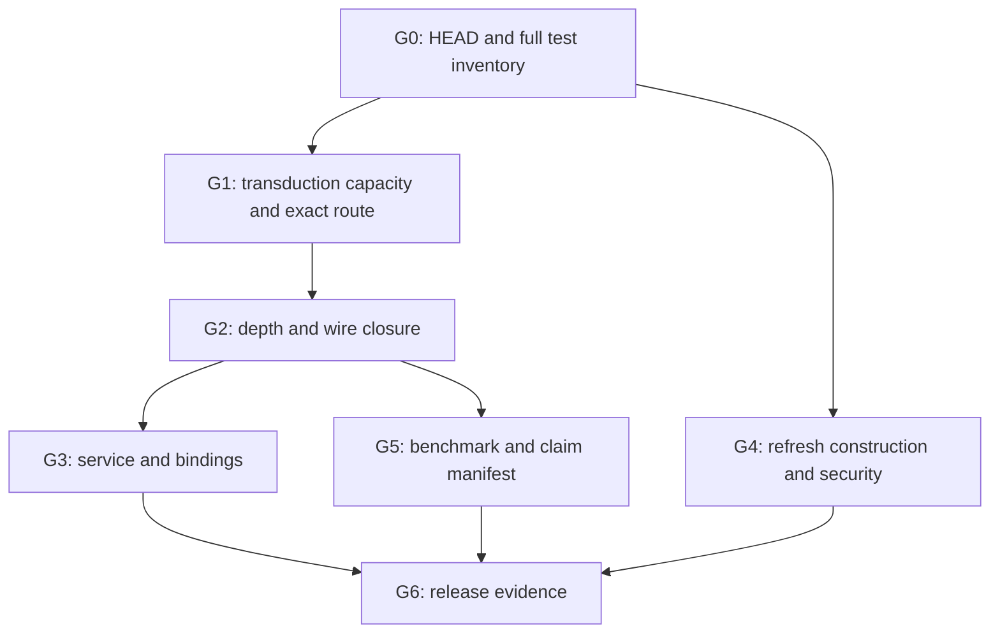

# NINE65: current-state reposition and execution gates

**Snapshot:** `main@a59896d96afecde26747f33cb37837e4ecab2825`, 2026-09-24.  Reconcile with a fresh remote HEAD before execution.  This is a work plan, not a capability or security certification.  [Issue #92](https://github.com/Skyelabz210/NINE65_v7/issues/92) remains the release tracker.

## Decision

The first product target is a **finite-depth, exact, mod-Q evaluator** with typed refusal at unsupported bounds, a working mod-Q service wire format, and reproducible evidence for each advertised tuple and mode.  CRAM supplies exact residue, rank, quotient, carry and lift operations within their certified capacity.  Published RLWE ciphertext/key state stays within the declared Q chain; transient auxiliary residues are derived and discarded within an operation.  Public refresh is a separately gated construction.  These contracts let the arithmetic research and usable evaluator advance independently while keeping security claims attached to actual parameters.

Three different milestones must be reported separately: (1) arithmetic and operation correctness; (2) end-to-end service and binding functionality; (3) externally supported security and production readiness.  A green isolated arithmetic test establishes only its own milestone.  `secure_128` and `secure_128_deep` currently share a tuple; count distinct tuple evidence once and check both public names for API correspondence.

## Corrections to the attached 2026-09-06 branch map and 2026-09-23 completion plan

| Earlier instruction or observation | Current evidence | Updated action |
| --- | --- | --- |
| 61 refs, 51 stale, 10 unique, including WR-8 and fail-closed Q branches as revival candidates | Fresh `git fetch --prune` at the snapshot found **66 non-main remote refs: 60 ancestor pointers and 6 refs with unique commits**. The older report's `51 + 10 = 61` also excludes `main` despite saying it includes `main`. | Recompute ancestry on every new HEAD; never infer open work from branch count. Do not delete any ref before checking active consumers and preserving provenance. |
| Rebase and split `assignment/wr8-service-input-hardening` and `codex/wire-q-and-mul-fail-closed` | Both refs are ancestors of current main; PR #115 and earlier WIRE-Q work landed. | Verify the *remaining* service wire and error-path behavior against #94/#85/#86/#89; do not merge those branches again. |
| Build and integrate `ExactMulPlan` as new WR-1 work | `crates/nine65/src/ops/exact_mul.rs` already has `ExactMulPlan`, `ExactMulEvaluator` and `RNSFHEContext::try_exact_evaluator`; `exact_mul_tests.rs` has independent bigint and named-configuration tests. The route is explicitly selected, and `mul_auto` does not select it. | Rerun these gates on current HEAD; identify missing capacity/noise refusal, route adoption and wire integration. Treat older Track-1 branch as test/design comparison only. |
| Resolve #132 and remove the silent legacy multiply from #135 | PRs #143 and #145 are merged; `BFVEvaluator::mul` now returns a typed error. | Verify the fixture and fail-closed tests; separately investigate the near-`t` `BFVEncoder::decode` bias in #135. Close issues only after every acceptance criterion is evidenced. |
| Add `--no-fail-fast`, pin Rust, fix service framing | Rust 1.89.0 is pinned. `CLAUDE.md`, `scripts/run_tests_medium.sh` and CI use `--no-fail-fast`. PR #115 added strict HTTP framing and `Connection: close`. | Measure complete target coverage and adversarial HTTP tests; #130/#64/#94 remain open until their other gates are satisfied. |
| Four revivable, two research, four dead unique branches | The old categories do not match their own ten detailed classifications. The six unique refs now are Track-1, lifted transduction, parked shadow anchor, functional-v7, old workflow, and vibe depth-analysis. | Compare the two research/implementation branches against main; retain depth evidence selectively; review historical refs before cleanup. |

### Newly elevated correctness risk: transduction capacity

`cram/lift-aware-transduction-safe-basis` now has **one** unique commit, `4bcdb7f`, which records a reproducible `TransductionMap::apply` wrong-residue result at FHE-scale bases: for `x=12345`, the pre-fix path reported `[439726063, 1143455338]` instead of `[12345, 12345]`.  The current main `crates/exact_transcendentals/src/transduction.rs` still builds basis products using unchecked `i128` multiplication and accumulates `raw += residue * idempotent` unchecked.  This is a live capacity boundary, even if present callers currently use small Safe Basis products.

**P0 extraction:** reproduce the stated vector in debug and release; independently verify the source and target residues using Python arbitrary-precision integers; review/cherry-pick the branch's checked-product and raw/wrap capacity certificate into a focused PR.  Check **all** calls to `TransductionMap::new`, especially `lifted_transduction.rs`: its panic-based constructor needs an explicitly bounded private basis or a typed `try_new` propagation at caller-controlled boundaries.  Certify products and intermediate sums, not merely the final basis product.  Test the largest accepted capacity and one step beyond, Safe Basis S6/S8, composite coprime carriers, negative/canonical input policy, and every reachable path.  Record before/after exactness and integer timings.  A capacity refusal is an acceptable result for large bases; silently wrapped residues are not.

## Execution DAG and gates

### G0 — Reproducible state and issue truth

Record HEAD, Rust 1.89.0, Cargo.lock hash, feature flags, CPU/OS, exact tuple fingerprints, command exit codes, per-target passed/failed/ignored counts, raw logs and CI links.  Run format/clippy and the full release suite with `--no-fail-fast`; run fast/medium tier scripts, then the explicitly ignored security, slow and diagnostic suites relevant to the claimed surface.  Reproduce every current #137 failure individually; do not reuse the September 4 count (1903 pass/20 fail/258 ignored) or assume PR #146 eliminated the noise-profile failures.  Active GitHub Actions and required branch checks in #79 require owner account/ruleset work; zero status checks at this snapshot give no CI release evidence.  Map #130, #64 and #69 to actual runs and compiler output.

### G1 — Exactness and capacity

Finish the transduction extraction above.  On `ops/exact_mul.rs`, run the independent bigint tensor, centered lift, scale-and-round, relinearization, shape/capacity, and four named-config end-to-end tests.  Repeat against an independent Python arbitrary-precision oracle at reduced public vectors.  Include carries, ties, floor(Q/t), centered boundaries, insufficient A capacity, wrong key/ciphertext shape, and U128/U256 edges.  Inspect the source-call-graph denylist and prove the transient basis cannot enter returned ciphertext or key material.  Issue #135 retains a separate decoder-rounding investigation.  Map issue #29 to operation-local metadata and a WIRE-Q compatible route; superseded persistent coprime ciphertext requirements must not be reintroduced.

**Depth gate:** `repeated_squaring_depth_is_measured_not_assumed` currently asserts only depth >= 1 and prints where a later wrong plaintext occurs; `try_decrypt_exact` documents that exhausted noise can return `Ok` with a wrong plaintext.  Establish an independently justified per-ciphertext depth/noise certificate or an earlier typed refusal for every advertised depth and seed matrix.  Measure the first wrong-output boundary and ensure it lies outside every supported call contract before expanding #73.  Keep finite depth and public refresh claims distinct.

### G2 — Wire and mode closure

Run the exact route against symmetric/public/CRAM-public entry points as actually exposed.  Diff the historical Track-1 branch's unique tests and base-extension logic against current main, porting only demonstrably missing gates.  Define a versioned mod-Q wire type with context-bound decode, canonical lanes, size caps before allocation, exact level and tuple identity, and trailing-byte rejection (#86).  Prove absence of persistent coprime auxiliary residues in ciphertexts, public keys, evaluation keys and serialized objects.  Document any secret-holder exceptions separately from published state.  No `mul_auto` or legacy route should claim the explicitly selected exact route's result without going through its certificates.

### G3 — Service, API and failure handling

`fhe-service/src/session.rs` still refuses dual-RNS export/import while handlers call that path; `/encrypt` tests in `main.rs` remain ignored for the WIRE-Q outage.  Connect the validated mod-Q wire type, restore service encrypt/decrypt/add/multiply and tenant-isolation oracle tests, then re-enable affected tests.  Recheck PR #115's strict Content-Length, TE, EOF, request-line, response cap, timeout and pipelining-close behavior under raw sockets (#94); test allocated bytes and exact response status.  Audit #85/#89 fallible constructors and panic behavior with release subprocesses.  Test Python binding #17/#63 against the same route and capability/error table; treat WASM/FFI as release scope only if advertised.

### G4 — Public refresh and security

Separate the parameter headroom predicate from Phase 1 arithmetic correctness.  Issues #95/#117 derive and measure a missing displaced quotient/carry correction; preserve the production `public_phase1_soundness_gate` until a complete construction and independent oracle establish `refresh(m) == m` before any post-refresh multiply.  Test circular, KSK-separated and auto variants (#16/#29), full-Q bootstrap mask sampling (#82), and a non-tautological security screen (#83).  If no exact construction is ready, retain typed refusal and synchronize the supported capability table.

Resolve custom/depth security labeling (#88), `secure_256` MATZOV interpretation (#76), independent lattice-estimator artifacts for exact shipped work/bootstrap tuples (#75), measured CT findings F-2/F-3 (#18/#72), and maintained Coq/Lean scope (#67).  An external review (#71) is separate evidence, with an explicit owner and deliverable.  Keep unsupported security labels out of production-facing APIs until attestation and review are complete.

### G5 — Comparative performance and claims

For every code-changing issue capture BASE and HEAD on the same machine, same profile/features and exact `(n, primes, t)` tuple.  Take >=3 independent runs of `cargo test -p nine65 --test op_timings --release --features allow_insecure -- --ignored --nocapture`, writing unique `NINE65_BENCH_JSON_OUT` artifacts.  Add focused exact-route tensor/relinearize/decrypt, service serialize/round-trip, and transduction-boundary timings.  Report raw integer nanoseconds, medians, dispersion, allocations where feasible, and rational/basis-point differences.  The existing canonical op matrix may benchmark the legacy route: **label route IDs separately** and verify plaintext equality on every timed path.  Time F-2/F-3 serially with clean controls.  Compare v6/v7 only after pairing equivalent tuples and actual operations; old same-name baselines are incommensurable after recuts.  Preserve benchmark baselines and explain reproducible >25% regressions.  Ratify README/API/claim-registry numbers only from immutable artifacts; do not convert micro-kernel results into full FHE operation claims.

### G6 — Release correspondence

Produce one machine-readable manifest keyed by immutable SHA and tuple, with a table for every open issue: reproduced, fixed, verified, blocked by owner/external dependency, or superseded with evidence.  Close issues and update #92 only when all stated acceptance criteria have links to tests, PRs and raw artifacts.  Align `README.md`, `CLAUDE.md`, service docs, binding docs and `docs/RELEASE_CHECKLIST.md` with the executable contract; the older March/August execution plans remain historical.  Keep release claims scoped to arithmetic functionality, service functionality, and attested security as separate rows.

## Branch provenance gates

| Unique ref at snapshot | Next action |
| --- | --- |
| `claude/track-1-derived-transient-exact-mul` | Diff unique tests and design against integrated `ops/exact_mul.rs`; port only missing assertions or fixes, prove benefit. |
| `cram/lift-aware-transduction-safe-basis` | Prioritize commit `4bcdb7f` capacity fix with independent reproduction and typed caller propagation. |
| `vibe/complete-tickets-73a415` | Compare diagnostic scripts/depth vectors with current ones; port still-valid evidence. |
| `claude/shadow-anchor-family-parked` | Require a concrete consumer, capacity and security rationale before revival. |
| `functional-v7-fhe`; `hardening/beyond-100-app-platform` | Preserve provenance; only extract still-missing assertions after comparison. |

Deleting branches is a separate maintenance action after validating no open PR, external link, automation, or unrecovered evidence relies on the ref.  Branch age alone never decides arithmetic or security correctness.
