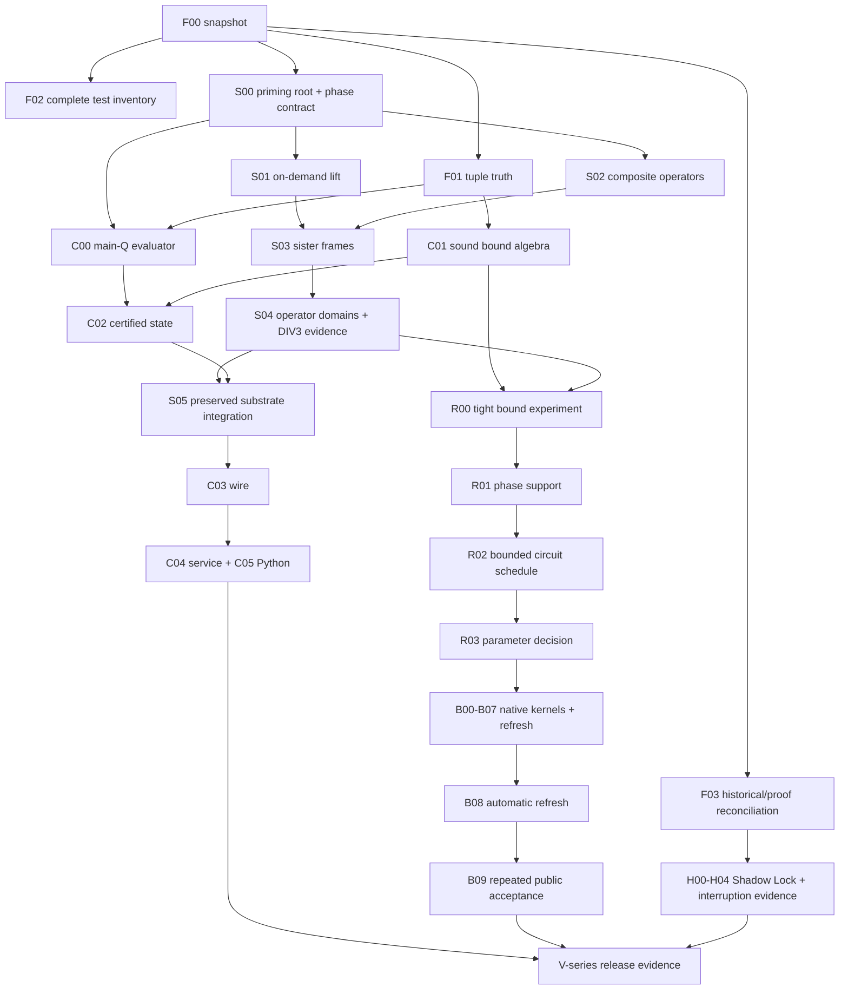

# NINE65: CRAM completion and public refresh execution plan

Prepared 2026-10-03. Target: native, exact modular BFV evaluation with automatic
public refresh, plus a separately specified Three Locks physical-protection
profile. This is an implementation contract, not a statement that the unfinished
cryptographic constructions are already solved.

Start with [the worker guide](WORKER_GUIDE.md). The authoritative work queue is
[tasks.json](tasks.json); individual task packets are under [tasks/](tasks/).
`python3 scripts/nine65_execution_plan.py validate` checks the package.

Revised after the owner's Safe Basis clarification and supplied monograph:
there are now **43 packets**, including S00–S05 for the intact priming root,
on-demand lift, composite operators and sister-frame integration. Read
[the architecture correction](SAFE_BASIS_REVISION.md) and
[the monograph/reconstruction reconciliation](OWNER_MODEL_RECONCILIATION.md)
before assigning implementation. These supersede the initial plan's omission
of that required substrate.

The subsequently supplied [K-elimination repositories](K_ELIMINATION_PROOF_BRIDGE.md)
and [Round I T1–T16 proofs](ROUND_I_TRACEABILITY.md) supply additional contracts
to reuse, particularly bounded recovery, arbitrary-target projection, ordering
and composite inverse discipline. Statement-level provenance and new checks
are recorded in [safe_basis_review.json](safe_basis_review.json).

## 1. The owner's architecture and the release we are building

Preserve the configurable residue arithmetic machine as the arithmetic core:
exact sign, magnitude, quotient, carry and division within explicit capacity;
derived auxiliary residues; integer runtime; public-parameter-bounded work;
lane-parallel arithmetic without Garner/running-value reconstruction in the
public evaluator. CRAM is not to be replaced by an opaque conventional FHE
backend to make the demo pass.

The S8 priming root `{2,3,5,7,11,13,17,19}` remains intact throughout admitted
operations. Sister trays provide configurable composite/shared-factor views
and operator assignments. Keep root factors, each operation's payload product,
lift anchors and dependent view moduli separate. Shadow-11 may belong to the
root while remaining outside a K-elimination payload product. Source CRT
constraints do not apply to every target view: arbitrary positive targets
need no target inverse merely to receive an exact projection. S00–S05 make
that asymmetry a checked part of the implementation.

Derive winding on demand from the selected live residue coordinates. The
owner has marked the monograph's MRS reconstruction pipeline as historical;
it is not a request to restore Garner or positional reconstruction internally.
The existing adjacent subtraction returns the winding under its current
coordinate convention; its separate observation step returns the original
integer. Every API must state which quantity it supplies.

The intended Shadow Lock harvests byproducts of off-path shadow computation as
an additional input to an independently keyed outer protection layer. The
Shannon mask and the working RLWE ciphertext have separate roles. The intended
physical property concerns what an attacker can recover when execution is
interrupted. Preserve this goal and its historical evidence; do not silently
substitute the current `ShadowHarvester` test generator for the whole design.

The owner's chosen computation target is performant, finite direct depth plus
automatic refresh. Recovering historical depth 50/200 is a provenance exercise,
not a prerequisite and not a target to obtain by changing a counter. A public
evaluator receives no working, bootstrap or outer decryption secret. A trusted
refresh service, if separately requested, is a distinct deployment profile and
does not satisfy the public-refresh milestone.

| Milestone | Required observable result | Does not establish |
|---|---|---|
| M0: reproducible CRAM core | Intact priming root and admitted sister frames; exact oracle agreement; typed capacity refusal; source-bound evidence | Public refresh or physical resistance |
| M1: useful public evaluator | Preserved substrate actually used by main-Q operations; certified finite depth; functioning service and Python surface | Unlimited supported workloads |
| M2: native public auto-refresh | Independently checked complete refresh; a subsequent multiply and another refresh; all coefficients; per-input admission; secure parameter assessment | Zero latency or arbitrary physical protection |
| M3: Three Locks profile | Specified attacker view, isolated key/mask lifetimes, actual shadow-source characterization, interruption tests and deployment-specific evidence | Security against an unrestricted snapshot of all keys and shares |

M1 is an intermediate deliverable. The public-auto-refresh goal is incomplete
until M2 passes. Any physical-protection claim must name its M3 profile. No
calendar estimate or task count overrides these acceptance conditions.

## 2. Frozen evidence and corrections to older plans

The starting v7 commit is `048f79ac771697801e26ebf77e4ee6df33b48281` with
pre-existing local modifications and untracked research. See
[evidence.json](evidence.json) for source hashes, the worktree inventory,
external revisions and checks actually run while preparing this plan.
The plan does not discard, commit or publish those modifications.

Aider, Gemini and Mistral performed bounded, read-only reviews of selected
source excerpts. Mistral used a task-local `thinking = "max"` setting; the
installed backend maps this to the provider's `reasoning_effort = "high"`.
Their final answers and [source-checked dispositions](reviews/REVIEW_DISPOSITIONS.md)
are retained. Agreement between models is not an acceptance test. In particular,
private certificate producers must not be made unrestricted because a reviewer
did not receive their implementation in its excerpt.

The v6 review uses
[`bd5c5c29f5c367bf34831cf5c1b97b3b938ac829`](https://github.com/Skyelabz210/NINE65_v6_a_Clockwork_Prime/tree/bd5c5c29f5c367bf34831cf5c1b97b3b938ac829).
Its relevant project is nested at `NINE65/NINE65_v6_a_Clockwork_Prime/`.
The supplied proof repository uses
[`d5c7a1f6e3da3068ddafbb2b48424ee13beac5d6`](https://github.com/Skyelabz210/qmnf-lean-coq-security-proofs/tree/d5c7a1f6e3da3068ddafbb2b48424ee13beac5d6).
Only selected sources were reviewed; neither historical repository was built
in full during plan preparation.

| Observed now | Consequence for the work queue |
|---|---|
| `TransductionMap::try_new` already checks products and intermediate capacity | Verify and close remaining callers; do not re-implement the old September P0 blindly |
| `ExactMulEvaluator` already provides main-Q-only multiply with derived transient auxiliary lanes | Adopt and extend this route; do not rebuild it from the old design document |
| Current S8 wrapper regenerates a fingerprint after BFV operations | This is not yet the continuously preserved priming substrate; S05 must connect actual frame computations |
| Lift-aware target projection accepts shared-factor composites | Preserve this capability; do not impose the source CRT constraints on every target view |
| Composite schemas still use prime-only Fermat inversion | Reproduced `Inv(2) mod15 = 2` instead of8; S02 repairs the implementation and domain checks |
| `CramPublicEvaluator::mul` and auto refresh still use the legacy dual path | Route integration is real work, separate from arithmetic-kernel success |
| Per-ciphertext `TrackedCiphertext` exists, but `ct` is public and `fresh` can wrap an arbitrary ciphertext | It is not an authenticated or mathematically sound input-noise certificate |
| Service ciphertext import/export deliberately refuse | A strict main-Q wire format and compatible main-only keys are on the shipping critical path |
| Legacy public Phase 1 loses a secret-dependent carry and refuses | Keep the gate; construct a new admitted backend instead of deleting the refusal |
| Encrypted expanded phase and same-prime paired views exist | Reuse them; canonical high-encoding low-digit removal remains missing at native parameters |
| Full-domain canonical polynomial fails present noise certificates | Do not just add eight primes or replace bounded integers with BigInt and call it solved |
| The current main-only full-Q sampler guards a 256-bit lane-sum limit | A wider bootstrap tuple also needs admitted context/key sampling and exact client decode; widening the multiply alone is insufficient |
| Bounded digit polynomial identities and external repeatable BFV runs exist | They are a construction reference; input support, native arithmetic and security remain gates |
| `verify_wr1_transient_exact.py` still calls a three-prime tuple `secure_128` | Its passing historical arithmetic vectors are not evidence for today's four-prime alias |
| `generate_depth_correctness_matrix.py` infers correctness from depth/collapse counters | Replace report inference with machine-readable decryption-oracle evidence |

The current v6 Three Locks code also decrypts the outer layer before inner
re-encryption and keeps the working secret locally. A lost Shadow Lock
integration has not yet been located. This is a recovery task, not proof that
the intended design never existed.

The proof corpus is valuable but needs statement-level reconciliation:

* `nist/shadow_nist_tests.py::generate_shadow_bits` draws a uniform `V` using
  Python `secrets.randbelow`, then takes its quotient. It does not sample live
  NINE65 NTT traces.
* `ShadowUniform.lean::shadow_uniform_distribution` assumes uniform `V` and
  states a remainder-distribution result. Quotient and remainder claims must
  be matched to the actual Rust operation before reuse.
* Some advertised independence/NIST theorems have conclusion `True`; other
  theorems prove range or reciprocal inequalities rather than the statistical
  claim described in their comments. Inventory actual types and dependencies,
  including `#print axioms`; absence of `sorry` alone is insufficient.
* The v6 depth matrix records symmetric depth 50, not the requested historical
  public-50/symmetric-200 pair. Recover the executable and exact tuple for each
  claim before carrying it forward.

## 3. Four budgets that must never be substituted for one another

| Resource | What CRAM / Shadow work can contribute | Admission rule |
|---|---|---|
| Arithmetic capacity | Exact residues, signs, ranks and quotient bounds; larger fixed limb capacity if required | Products and intermediate ranges fit; no silent wrap or saturating stand-in |
| Decryption headroom | Avoid implementation error; prove tighter operation-specific BFV bounds | Correct plaintext for every input within the admitted bound; nonzero error and floor-scale terms remain |
| Cryptographic unpredictability | Recover otherwise discarded uncertainty if the source is unknown to the attacker | Conditional source model, state-compromise analysis and valid conditioning; deterministic public computation earns zero new secret entropy |
| Attack cost | Candidate smaller Q or different circuit may permit a better security/cost tradeoff | Estimate exact ring, Q, secret/error distributions, key relationships and sample counts; never lower noise and inherit the old security label |

For a deterministic shadow `S=f(X)`, knowing `X` lets an attacker compute `S`.
Exactness does not create independent entropy. If inputs contain hidden
randomness, harvesting may retain useful uncertainty; the missing quantity is
uncertainty **conditioned on the attacker's entire view**, not output bit width.
Adding an encryption of zero rerandomizes and adds error; it does not restore
an exhausted BFV noise budget. An outer lock's error belongs to its own
encoding/noise proof, not to the work ciphertext's refresh credit.

NIST distinguishes statistical testing from cryptanalysis in
[SP 800-22](https://csrc.nist.gov/pubs/sp/800/22/r1/upd1/final).
[SP 800-90B](https://csrc.nist.gov/pubs/sp/800/90/b/final) provides entropy-source
design and validation requirements. These support source characterization;
they do not certify this implementation merely because similarly named tests
or theorems exist.

## 4. Concrete architecture to converge on

```mermaid
flowchart LR
  Client["Client: secret keys, encrypt/decrypt"] --> Wire["Validated main-Q wire"]
  Wire --> Root["Intact Safe Basis root + on-demand lift"]
  Root --> Frames["Configurable sister/operator frames"]
  Frames --> Core["CRAM exact public evaluator + bound state"]
  Core --> Admit["Predict next operation and refresh input margin"]
  Admit -->|enough capacity| Core
  Admit -->|refresh required and admitted| Refresh["Native bounded-digit public refresh"]
  Refresh --> Core
  Core --> Result["Main-Q result + provenance"]
  Result --> Client
  Shadow["Off-path shadow source + independent secure seeds"] --> Locks["Three Locks deployment profile"]
  Locks -. protects specified physical boundary .-> Client
```



Reuse `RNSCiphertext`, `RNSPublicKey`, `RNSSecretKey`, `ExactMulEvaluator`,
`RNSHybridGadgetKey`, `ExpandedPhase1Plan`, `PrimePowerPhaseEvaluator`, and
`PrimePowerDigitRemoval` where their contracts fit. Introduce small wrappers,
not a second FHE engine. Proposed names below are contracts to implement, not
claims that these types already exist:

```rust
struct EvaluatorContextId([u8; 32]); // hash canonical public parameters + route version
struct KeyDomainId([u8; 32]);       // binds an actual key family, not just parameters
struct CertifiedCiphertext {       // private fields; no unrestricted fresh wrapper
    ciphertext: RNSCiphertext,
    bound: CertifiedNoiseBound,
    context: EvaluatorContextId,
    key_domain: KeyDomainId,
    provenance: Provenance,
}
struct PublicRefreshPlan { /* private admitted circuit, tuple and error certificate */ }
struct PublicRefreshKeys { /* public evaluation material only */ }
// PublicRefreshEvaluator::try_refresh accepts CertifiedCiphertext and public keys.
// Checked public constructors/evaluation maintain the bound. Wire bytes alone do not.
```

1. Public wire carries main ciphertext residues, explicit coefficient/NTT domain,
   Montgomery convention, level, `t`, ordered-basis fingerprint, key family and
   schema version and public frame/role descriptors where needed. No unreviewed
   secret-dependent auxiliary residue or derived witness is emitted.
   Deterministically recomputable residues are not inherently new leakage;
   the main-only rule makes provenance and transport enforceable. Re-establish
   the admitted internal root/frame contract on import; the wire policy must
   never be used as permission to remove the priming substrate.
2. All operations select an explicit route. Adopt the current exact transient
   main-only multiply and main-only evaluation keys. Never strip anchor fields
   and continue calling a kernel whose correctness assumes them.
3. A noise bound is an immutable, versioned upper bound in integer/rational
   units, with public secret/error support assumptions and operation lineage.
   It is not a measured secret-dependent error, a millibit display value or a
   caller-supplied assertion. Import without trusted provenance is unadmitted
   until a supported policy supplies a bound.
4. Client decryption and correctness oracles may reconstruct. Evaluator hot
   paths may use bounded fixed-work integer metadata but may not reconstruct
   a ciphertext coefficient or introduce a Garner cascade. External reference
   implementations remain outside the shipped runtime dependency graph.
5. Key switching changes key domain; plaintext-encoding conversion is a
   separate certified operation. Provenance tags are not proofs of input noise.

## 5. Public refresh: preferred construction and hard research gates

The complete candidate is coefficient/slot transforms, controlled expanded
phase error, bounded-error digit removal at `p^2`, contraction, and return to
the work key. Reuse the independent Fheanor reference as an oracle, not as
the runtime. The construction literature is
[Geelen–Vercauteren](https://eprint.iacr.org/2022/1363) and the bounded-support
technique of [Ma et al.](https://eprint.iacr.org/2024/115); the latter paper is
about BGV, so NINE65's BFV encoding and error bridge must be established locally.

For an admitted shifted phase `x=p*m+rho+h mod p^2`, `h=(p-1)/2`, the existing
compiler constructs `F` satisfying `F(rho+p*m)=rho mod p^2` for `|rho|<=B`.
Then `h+F(x-h)` is the canonical low digit when `B<=h`. The contraction consumes
an **encrypted high-encoding** value of that digit. A clear oracle, ordinary
`Enc_p(r)`, scalar inverse or a public sign bit of the hidden phase is not a
replacement.

| Gate | Required artifact before dependent coding | Failure action |
|---|---|---|
| R00: tighter arithmetic bounds | Exact phase/error term decomposition, independent oracle and enforceable operand assumptions | Retain conservative bounds; do not reduce a certificate to fit |
| R01: input error radius | Derive `B` including prior ops, transforms, rounding, switch errors and permitted key distribution | Stop native bounded lift; no guessed B=17/32 from observed samples |
| R02: circuit schedule | Exact polynomial identity, encrypted addition/multiply/relin DAG, bound at every node and operation/resource counts | Change schedule or construction explicitly; do not evaluate a refused plan |
| R03: admitted candidate | Whole-pipeline capacity + noise + return-key + security inputs for at least one tuple | Keep public refresh disabled and report the smallest failed inequality |

Run two parameter searches: (A) current CRAM tuples with sharper sound bounds
and bounded circuits; (B) a wider native tuple based on the working reference.
This directly tests the owner's tighter-parameter hypothesis. Preserve a
counterexample to each rejected shortcut. Search can use GSO, but every proposed
candidate passes the same deterministic validator; the optimizer cannot issue
its own certificate.

S04 supplies the precise domains and encrypted status of proposed operator
substitutions, including DIV3, before R00 gives them a bound improvement.
Reconfiguring a sister view is not automatically a BFV modulus switch: if Q,
the encoding or key domain changes, its corresponding certificate must change.

The existing full-domain polynomial baseline's complete certificate lower
bound is 1,056–1,095 bits across the recorded candidates, with at most 202 bits
of high-encoding half-scale. That is a result about this baseline, not an
impossibility theorem. The reference `N=8192, log2 Q≈990` success is a functional
experiment, not a secure parameter recommendation. A larger `N=32768` candidate
must include sparse-secret and evaluation-key analysis, memory and repeat tests.
For `p=65537`, the current degree-one slot argument requires `2N | p-1`;
increasing N beyond 32768 changes that construction and is a new design gate.

## 6. Shadow Lock and physical interruption work

Work from the recovered mechanism's actual dataflow: source inputs → shadow
capture → accumulator/conditioner → sampler → independent key/error field →
outer protection → masking/refresh lifetime → recovered attacker state.
Record where each arrow exists, was removed, or is still a design placeholder.

The baseline implementation must retain independently seeded standard secure
randomness for keys/masks; shadow samples may be additional conditioned input.
That baseline earns no extra entropy credit from the shadows. A variant that
reduces the independent random input or claims an independent second RLWE
assumption requires H01's source proof and H02's protocol review first. Two
layers do not automatically double security bits.

Define distinct attacker profiles before implementation:

* P1: a specified external memory bus view, excluding protected key registers
  only if the deployment actually enforces that exclusion;
* P2: process interruption and recoverable RAM, with an explicit inventory of
  keys, masks, shares, copies, spills, swap and crash dumps;
* P3: power/clock/EM faults and post-interruption recovery on named hardware.

No destructor is assumed to run after power loss. `ZeroizeOnDrop` covers normal
lifetimes only. Ordinary Rust local variables do not imply register-only
storage. If the attacker's allowed snapshot includes the working secret or all
mask shares, that profile fails without breaking RLWE or a one-time pad.
Report this as a failed profile and revise isolation; do not describe it as a
failure of CRAM arithmetic or use a software test as an EMP certification.

The current outer layer returns `masked_poly + e`, not byte-exact plaintext;
its additional error must be included before the inner decode. It currently
handles coefficient zero only. H02 must choose a reviewed lossless envelope or
prove the permitted error for full-polynomial refresh before H03 implementation.
No small-model worker is tasked with inventing a cryptographic envelope.

## 7. Execution order and resource policy



Use one task packet per model session and one owner per writable file. Parallel
execution is possible only for disjoint file sets with accepted dependencies.
Test authors can prepare independent oracles before implementation, but cannot
accept their own implementation on a same-formula test alone. The queue marks
research, protocol and external-review gates explicitly. Smaller models can
collect counterexamples and implement frozen interfaces; they must not fill
missing theorems with guessed constants or soften stop conditions.

This sandbox had about 1.1 GiB free at preparation. Run integer Python probes
and targeted existing tests first; do not start several Cargo builds or a wide
bootstrap key generation. F02 inventories disk/RAM before the full suite.
Use `--locked --offline -j1` once dependencies are present, and `--no-fail-fast`
for acceptance suites. Record out-of-space/OOM as infrastructure failure.
Never delete user artifacts or the entire target directory to make a task pass.
Release measurements use the pinned release profile; reduced-debug builds may
assist development but cannot replace it in evidence.

Tasks may be split into smaller subpatches while retaining the same acceptance
contract. Never merge a placeholder constructor that returns an admitted plan.
If a task needs more than its packet establishes, return `BLOCKED_DESIGN` with
the exact missing equation/interface, not a plausible-looking implementation.

## 8. Final acceptance matrix

| Property | Mandatory evidence |
|---|---|
| Exactness | Independent scalar and negacyclic oracles, all coefficients, signs, ties, lane permutations, level boundaries, near-t messages, refusal just outside capacity |
| Priming substrate and sister frames | All eight root roles preserved; bounded source/anchor splits; on-demand lift; composite/shared-factor views; correct unit inversion; atomic add/drop/re-add; integer-vs-topology semantics; actual operation/executor dataflow |
| Certified operation history | Fork/join DAGs; mutated/imported/raw ciphertext rejection; context/key mismatch; public bound propagation; actual error stays below bound in toy exhaustive tests |
| Complete public refresh | Fresh/add/mul/relin/boundary inputs at each admitted level; no evaluator secret; refresh→multiply→refresh; negative test with corrupted lift/certificate |
| Production randomness | Fresh independent production seeds, full-Q sampling, secure-feature build without dev feature unification; failures propagated before key output |
| Wire and service | Main-Q-only keys and ciphertexts, exact domain tags, canonical lanes, bounds before allocation, trailing-byte refusal, tenant isolation, HTTP framing, malformed/mutated payloads |
| Parameter security | Exact tuple and key/sample distributions, pinned estimator input/output, classical/quantum models, sparse/bootstrap-key relationship review, no inherited profile-name claim |
| Physical profile | Key/mask/copy lifetime map, actual source traces, interruption snapshots and assembly evidence; hardware results for a hardware claim |
| Performance | Same tuple/route/hardware/compiler, >=3 runs, integer timings, medians/p95/resources; explicit refresh counts and amortized cost; every timed result checked |
| Formal correspondence | Precise theorem statements, build logs for imported modules, axiom report, Rust-to-proof assumptions, no `True` placeholder promoted to security evidence |
| Release | Full target inventory and logs, maintained quality gates, reproducible artifact hashes, claims generated from accepted evidence, documented unresolved limits |

The queue references all 29 open GitHub issues observed during preparation;
an open title is a tracking item, not proof its original bug still exists.
Reproduce and satisfy the body's acceptance criteria before proposing closure.
Do not post, close issues, publish packages or push a release as part of a worker
task unless the owner separately instructs it.

The decisive priority is the admitted priming substrate S00–S05 together with
C00–C04: connect the exact main-only arithmetic engine to live CRAM frames,
certified inputs and a usable service. In parallel with that engineering,
R00–R03 determine a valid complete public-refresh circuit.
Historical Shadow work feeds H00–H04 without weakening either gate. This lets
the project demonstrate real CRAM value immediately while keeping the final
auto-refresh and physical-protection obligations explicit.
